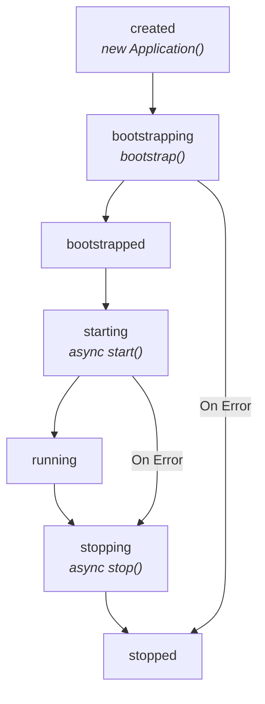

# Core

## Lifecycle

```mermaid
  flowchart TD
    created["`created<br>*new Application()*`"]
    bootstrapping["`bootstrapping<br>*bootstrap()*`"]
    bootstrapped
    starting["`starting<br>*async start()*`"]
    running
    stopping["`stopping<br>*async stop()*`"]
    stopped

    created --> bootstrapping
    bootstrapping --> bootstrapped
    bootstrapped --> starting
    starting --> running
    running --> stopping
    stopping --> stopped

    bootstrapping -- On Error --> stopped
    starting -- On Error --> stopping

```